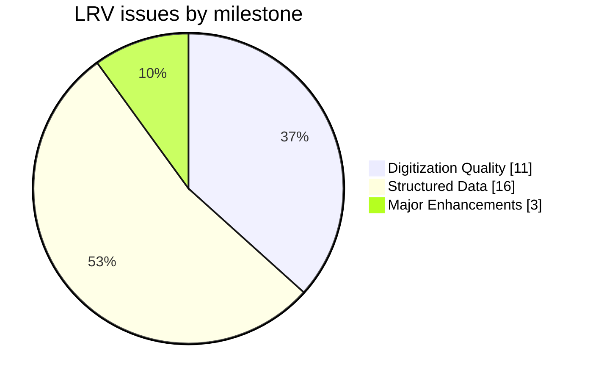
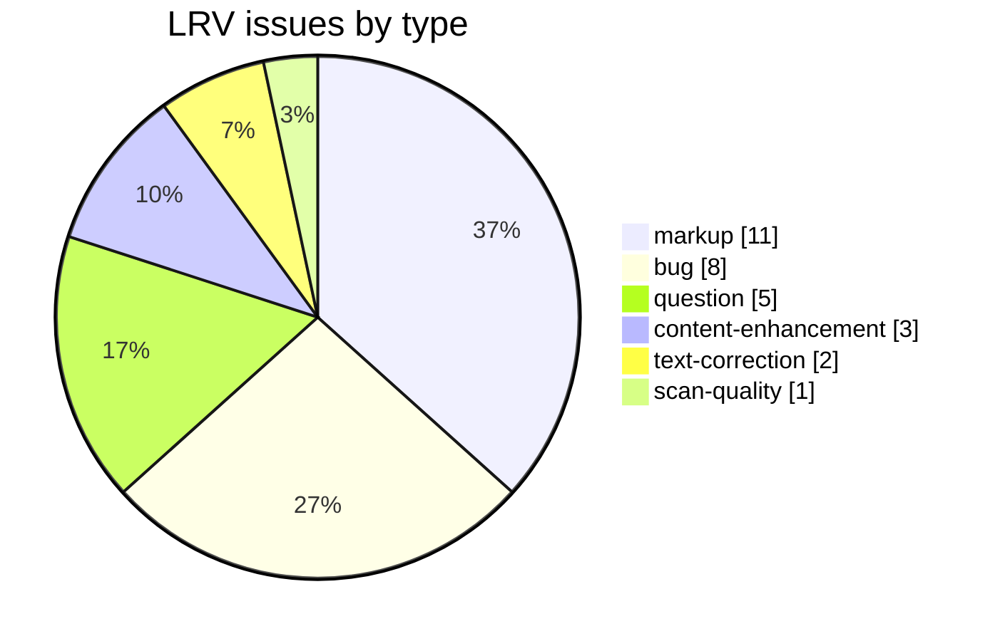
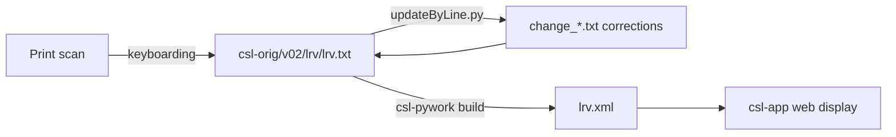

# LRV — Vaidya *The Standard Sanskrit-English Dictionary* (1889)

Development and correction repository for **L. R. Vaidya's *The Standard Sanskrit-English Dictionary***, a Sanskrit→English dictionary, part of the [Cologne Digital Sanskrit Lexicon](https://www.sanskrit-lexicon.uni-koeln.de/) (CDSL). The canonical source text lives in [`csl-orig/v02/lrv/lrv.txt`](https://github.com/sanskrit-lexicon/csl-orig/blob/master/v02/lrv/lrv.txt) (48,259 entries); this repository holds the development, correction, and enrichment work.

An Indian-authored Sanskrit–English dictionary, digitized at Cologne from a HathiTrust copy.

## Documentation

- [CLAUDE.md](CLAUDE.md) — repository guide and data-format reference.
- [DATA_DICTIONARY.md](DATA_DICTIONARY.md) — markup tag reference.
- [CONTRIBUTING.md](CONTRIBUTING.md) · [CODE_OF_CONDUCT.md](CODE_OF_CONDUCT.md)

## Contents

| Path | Purpose |
|---|---|
| `glacier/` | `glacier/` working files |
| `interim/` | `interim/` working files |
| `issues/` | Per-issue working files |
| `logs/` | `logs/` working files |
| `scripts/` | `scripts/` working files |

## Timeline

| Period | Activity |
|---|---|
| 2022 | Repository activity begins (first tracked issues) |
| 2024–2024 | Ongoing corrections, markup, and comparison work |
| 2026-05 | Issue taxonomy, citation metadata, documentation |

## Projects & Milestones

| Milestone | Open | Closed | Total |
|---|---|---|---|
| Dictionary to Book | 0 | 0 | 0 |
| Digitization Quality | 0 | 11 | 11 |
| Structured Data | 2 | 14 | 16 |
| Major Enhancements | 0 | 3 | 3 |
| **Total** | **2** | **28** | **30** |

## Issues

### Open

| # | Title | Type | Severity | Milestone |
|---|---|---|---|---|
| 13 | Debatable entries | question | minor | Structured Data |
| 29 | LRV compounds - Add markup for indentation level for comp… | markup | minor | Structured Data |

### Solved

| # | Title | Type | Severity | Milestone |
|---|---|---|---|---|
| 1 | 18 odd entries | question | minor | Structured Data |
| 2 | page sequence v/s page column | markup | minor | Structured Data |
| 3 | Comma separated entries with multiple gender details | bug | minor | Digitization Quality |
| 4 | Two spaces instead of one after 'b' tag | markup | minor | Structured Data |
| 5 | Some errors while finding key2 | markup | minor | Structured Data |
| 6 | transliteration error | bug | minor | Digitization Quality |
| 7 | revert_2to1.py errors which give rise to differences | bug | minor | Digitization Quality |
| 8 | Duplicate page-sequence | bug | minor | Digitization Quality |
| 9 | Multiple headword as first part and single word as second… | bug | minor | Digitization Quality |
| 10 | Find headword differences programmatically | text-correction | minor | Digitization Quality |
| 11 | Find headwords missing in sanhw1 (Cologne dictionary head… | question | minor | Structured Data |
| 12 | Brackets showing alternate headwords | markup | minor | Structured Data |
| 14 | Potential places to find new headwords | content-enhancement | medium | Major Enhancements |
| 15 | Add to csl-orig repository | content-enhancement | medium | Major Enhancements |
| 16 | xmllint errors on lrv.xml | bug | minor | Digitization Quality |
| 17 | New xml lint errors | bug | minor | Digitization Quality |
| 18 | miscellaneous corrections | text-correction | minor | Digitization Quality |
| 19 | Feminine alternate words | markup | minor | Structured Data |
| 20 | neuter gender headwords | markup | minor | Structured Data |
| 21 | Add scanned pages | scan-quality | minor | Digitization Quality |
| 22 | lrvheader | bug | minor | Digitization Quality |
| 23 | Add LRV to simple-search dictionary list | content-enhancement | medium | Major Enhancements |
| 24 | semantic versioning how to | question | minor | Structured Data |
| 25 | LRV headwords not marked as per CDSL style | markup | minor | Structured Data |
| 26 | Lbody for LRV | question | minor | Structured Data |
| 27 | Lbody with full headwords | markup | minor | Structured Data |
| 28 | LRV Lbody seems to have missed some data | markup | minor | Structured Data |
| 30 | [markup] Minor lrv.txt Markup Oddities | markup | minor | Structured Data |

## Labels

### Type labels

| Label | Meaning |
|---|---|
| `link-target` | Click-throughs from `<ls>` abbreviations to scanned PDF pages |
| `link-splitting` | Splitting combined `SOURCE N,N` refs into per-page links |
| `markup` | Normalising XML tag content |
| `text-correction` | Corrections to English/Sanskrit definitions or headwords |
| `content-enhancement` | New material or structural additions beyond correction |
| `encoding` | SLP1/IAST transcoding, character normalisation |
| `scan-quality` | Replacing blurry/skewed/missing scan pages |
| `bug` | Broken links, XML errors, broken downloads |
| `question` | Scholarly questions requiring research |

### Severity labels

| Label | Meaning |
|---|---|
| `minor` | Targeted fix — a handful of lines or a single file |
| `medium` | Standard unit of work — one batch of corrections |
| `hard` | Large effort spanning many sources or files |

## Contributors

| Contributor | Commits |
|---|---|
| drdhaval2785 | 121 |
| gasyoun (Mārcis Gasūns) | 3 |
| funderburkjim | 2 |

## Source

- **Author**: Vaidya, L. R.
- **Title**: *The Standard Sanskrit-English Dictionary*
- **Place / Publisher**: Bombay
- **Year(s)**: 1889
- **Language pair**: Sanskrit → English
- **Size (CDSL headword index)**: 48,259 entries
- **License (digital edition)**: CC BY-SA 4.0
- See [CITATION.cff](CITATION.cff) for machine-readable citation.

## Encoding

- UTF-8 (NFC) throughout.
- Sanskrit text in SLP1 transliteration, wrapped in `{#…#}`; English gloss / italic display text in ``.
- Devanāgarī and IAST display forms are generated at display time, not stored in the source.

## How it works

---
*Issue taxonomy and documentation per the [Cologne issue runbook](https://github.com/sanskrit-lexicon/csl-observatory/blob/main/runbook/cologne-issue-runbook.md).*
