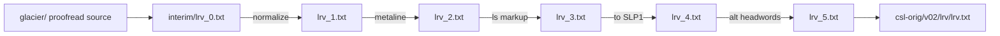

# LRV — L. R. Vaidya's *Sanskrit-English Dictionary* (1889)

_Created: 22-05-2026 · Last updated: 11-07-2026_

## Why this repo exists

L. R. Vaidya's 1889 *The Standard Sanskrit-English Dictionary* (with appendices on prosody and mythological names, digitized copy at [HathiTrust](https://catalog.hathitrust.org/Record/008693928)) had to go from a proofread OCR transcript to CDSL's structured markup format before it could join the [Cologne Digital Sanskrit Lexicon](https://www.sanskrit-lexicon.uni-koeln.de/) collection at `csl-orig/v02/lrv/lrv.txt`. That conversion isn't a single script — a raw proofread text has no entry boundaries, no SLP1 transliteration, no `<ls>` literary-source markup, and inevitably its own transcription slips (duplicate line numbers, headwords that don't match their `<k2>` sort key, missing compound cross-references). This repo is the multi-stage pipeline that did that conversion once, plus the quality-check scripts and per-issue correction workflows that keep catching new defects as they're found.

## How it works

The conversion runs in five incremental stages (`interim/lrv_0.txt` → `lrv_5.txt`), each stage's change documented in [`interim/README.md`](https://github.com/sanskrit-lexicon/LRV/blob/main/interim/README.md):

| Stage | What changed |
|---|---|
| `lrv_0.txt` | Copy of [`glacier/LR_Vaidya_Main_proofed_20220920.txt`](https://github.com/sanskrit-lexicon/LRV/blob/main/glacier/LR_Vaidya_Main_proofed_20220920.txt) (the proofread source) |
| `lrv_1.txt` | Line endings normalized `\r\n` → `\n` |
| `lrv_2.txt` | `<L>`/metaline markup added; kept only key2, grammar, and entry text |
| `lrv_3.txt` | `<ls>` literary-source markup added; `//` paragraph breaks → `<P>` |
| `lrv_4.txt` | Devanāgarī → SLP1 conversion |
| `lrv_5.txt` | Alternate headwords added — this is the CDSL-ready output |


```mermaid
flowchart LR
  G["glacier/ proofread source"] --> I0["interim/lrv_0.txt"]
  I0 -->|normalize| I1["lrv_1.txt"]
  I1 -->|metaline| I2["lrv_2.txt"]
  I2 -->|ls markup| I3["lrv_3.txt"]
  I3 -->|to SLP1| I4["lrv_4.txt"]
  I4 -->|alt headwords| I5["lrv_5.txt"]
  I5 --> O["csl-orig/v02/lrv/lrv.txt"]
```

Quality-check scripts ([`scripts/qc_*.py`](https://github.com/sanskrit-lexicon/LRV/tree/main/scripts)) then catch specific defect classes — duplicate line numbers, duplicate `<pc>` page refs, headword/`<k2>` mismatches, missing compound cross-references — and per-issue folders under [`issues/`](https://github.com/sanskrit-lexicon/LRV/tree/main/issues) hold the fix for each defect found this way.

## Usage example (verified)

The pipeline's real output is already committed at [`interim/lrv_5.txt`](https://github.com/sanskrit-lexicon/LRV/blob/main/interim/lrv_5.txt) — 190,412 lines, compared to 43,598 lines in the original proofread source (`glacier/LR_Vaidya_Main_proofed_20220920.txt`; the growth is markup, not new content). Its first entry:

```
<L>00001<pc>001-01<k1>a<k2>a
a¦  An interjection- (1) of pity; (2) of calling, e.g. {#a anaMta#}; (3) of blame or reproach, e.g. {#a pacasi tvaM jAlma#}.
<LEND>

<L>00002<pc>001-01<k1>a<k2>a
a¦  A prefix implying- (1) negation arising from similarity...
<LEND>
```

`<k1>a<k2>a` is the headword "a"; `` marks italic grammatical notes; `{#...#}` marks SLP1 Sanskrit examples (`a anaMta`, `a pacasi tvaM jAlma`) — the same CDSL entry format used across the Cologne collection (compare [`BOR/readme.md`](https://github.com/sanskrit-lexicon/BOR/blob/main/readme.md)'s `bor_corrected.txt` sample). This confirms stage 5 of the pipeline actually produced valid, entry-delimited CDSL markup from the raw proofread text.

Re-running the full pipeline was not attempted here — `scripts/redo.sh` regenerates all five interim stages from the glacier source and would rewrite tracked files; the sample above is real already-committed pipeline output, not synthesized.

## Common commands

```sh
cd scripts
sh redo.sh                # full conversion pipeline, lrv_0 through lrv_5
sh quality_check.sh        # run all qc_*.py scripts, summarize results
```

Rebuild and validate XML (from `csl-pywork/v02/`):
```sh
sh generate_dict.sh lrv ../../LRVScan/2020
sh xmlchk_xampp.sh lrv
```

## Layout

| Path | Purpose |
|---|---|
| [`scripts/`](https://github.com/sanskrit-lexicon/LRV/tree/main/scripts) | `lrv_prep1.py`–`lrv_prep5.py` (stage scripts), `parseheadline.py`, `qc_*.py` (quality checks), `redo.sh`, `revert_Nto(N-1).py` rollback scripts |
| [`issues/issueNNN/`](https://github.com/sanskrit-lexicon/LRV/tree/main/issues) | Per-issue correction workflow: copy `lrv.txt`, apply corrections, rebuild XML, validate, commit to `csl-orig` (the canonical 8-stage csl-orig procedure lives in [csl-corrections/docs/correction-workflow.md](https://github.com/sanskrit-lexicon/csl-corrections/blob/main/docs/correction-workflow.md)) |
| [`interim/`](https://github.com/sanskrit-lexicon/LRV/tree/main/interim) | The five pipeline stages described above |
| [`glacier/`](https://github.com/sanskrit-lexicon/LRV/tree/main/glacier) | Archived/historical proofread source versions |
| [`logs/`](https://github.com/sanskrit-lexicon/LRV/tree/main/logs) | Pipeline execution logs |

## Dependencies

Python 3; the proofread source `lrv.txt` lives at `$BASE/cologne/csl-orig/v02/lrv/lrv.txt`.

---

_Dr. Mārcis Gasūns_
